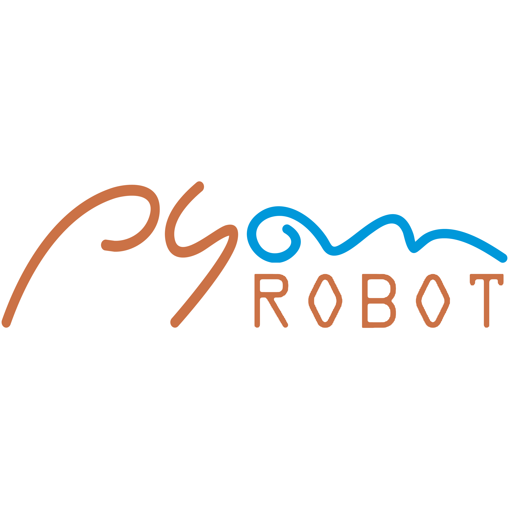

# pyon-robot-ui-tests-web
PYON ROBOT - UI Test Automation with Robot Framework

Pyon UI Test Automation project is available to implement UI tests for web and mobile applications with the following stacks and approaches:

- Programming Language: [Python-based](https://www.python.org/downloads/).
- Framework for behavioural tests: [Robot Framework](https://robotframework.org/)
- Minimal library requirements: [Selenium2Library-Robot](http://robotframework.org/Selenium2Library/Selenium2Library.html)

To know how you can configure your environment to implement and execute this project locally or even remotely, follow all the instructions from this documentation. So, let's start with it and good luck!

## CLONING THE PROJECT FROM GITHUB

Go to [GITHUB](https://github.com/hudsonssrosa/pyon-robot-ui-tests-web) and **CLONE** the project using **GIT** (download and install GIT from [here](https://git-scm.com/downloads))

In you local machine, choose you local repository and clone the project using SSH for Mac OS or Linux platforms with this command:

```bash
    git clone git@github.com:hudsonssrosa/pyon-robot-ui-tests-web.git
```

If you are having issues when cloning or pushing to the repository make sure you have all your SSH keys in place. Click [here](https://help.github.com/en/github/authenticating-to-github/connecting-to-github-with-ssh) for more information about it.

## PREPARING YOUR ENVIRONMENT

### 1. Install Python

Download and install the [latest Python](https://www.python.org/downloads/) version (3.8 or over). Then, in any terminal, try this command to check if Python is correctly installed:

```bash
      python
```

### 2. Choose a good IDE

Once you have opened the project in an IDE of your preference (suggestion: install [Visual Studio Code](https://code.visualstudio.com/download) or [PyCharm CE](https://www.jetbrains.com/pycharm/)), then you will need to *set the Python interpreter* for the project.

After this, you are able to create the *Python Virtual Environment* for the PyonUIT project and install all the requirements needed (libraries/packages). You just need to run for the first time the `update.py` and then the virtual environment as well the libraries in `requirements.txt` will be automatically installed for you.

- In Windows:

```bash
      python update.py
```

- In MacOSX or Linux:

```bash
      python3 update.py
```

### 3. Ways to run this project

By default, the tests will run locally on Chrome browser, but you have 3 ways to customise your execution.

#### 3.1 Run in debugging mode

To check if the environment is totally operational to begin with some implementation, or even check the existing tests, you might dealing with the environment variables to prepare for an execution. Thus, copy the file `env_settings.properties.local` and paste the new one in project's root (in the same place as the original file) renaming it to `env_settings.properties`. So, you can edit the properties freely, because this file is ignored by GIT versioning.

Into this file, to consider a development setting, ensure the property `development_mode` is set as `true`. With this, all the properties that start with `debug_...` will be considered in a project debugging overwriting any command lines from CLI:

```properties
    development_mode = true
    debug_flag_environment = staging

    # Get more information about PYON CLI, type in the terminal console: "python behave_runner.py --help"
    debug_flag_target = local
    debug_flag_os =
    debug_flag_os_version =
    debug_flag_device_name =
    debug_flag_browser =
    debug_flag_browser_version =
    debug_flag_mode = web
    debug_behave_tags = *
    debug_behave_excluded_tags = wip
    debug_flag_orientation =
    debug_flag_resolution = 1280x1024
```

- To generate Allure Reports locally, make sure you have `Java` installed and the flag `generate_report = true` on your `env_settings.properties`.

#### 3.2 Run as if it were in CI

After any implementation into the PyonUIT, it is recommended to validate the tests simulating an execution capable to inject parameters in environment variables, like it is performed in a build from a CI server.You also will need to copy the file `run_robot.sh.local` and paste the new one in project's root (in the same place as the original file) renaming it to `run_robot.sh` to be ignored in commits.

Into this script file, you can set those environment variables, like this:

```bash
    PYON_ENVIRONMENT='staging'
    PYON_TARGET='local'
    PYON_MODE='web'
    PYON_OS='MacOS Catalina'
    PYON_OS_VERSION=
    PYON_DEVICE='local'
    PYON_BROWSER='chrome'
    PYON_BROWSER_VERSION='90.0'
    PYON_ORIENTATION='Portrait'
    PYON_RESOLUTION='1280x1024'
    PYON_TAGS='*'
```

#### 3.3 Run via CLI (only command line)

You can handle all those parameters presented previously (in section 4.2) setting them directly via CLI. You just need to pass the desired values in the arguments by command line.
First of all, call the main runner file in the terminal and press Enter. So, try this:

```bash
      python3 robot_runner.py --help
```

You might see all the supported arguments that you can use:

```bash
usage: robot_runner.py [options]

optional arguments:
  -h, --help            show this help message and exit
  --environment {staging,dev,production}
                        ==> Environment to execute the tests (default = staging). Find the app URLs in properties file
  --target {local}      ==> Platform to execute the tests (in browsers: default = local): LT - LambdaTest; BS - BrowserStack; CBT
                        - CrossBrowserTesting
  --mode {web,headless,mobile}
                        ==> Browser execution mode according the platform / OS (default = web)
  --os {MacOS High Sierra,MacOS Catalina,MacOS Big sur,Windows,Windows 10,iOS,Android,}
                        ==> Operational System from the current server
  --os_version {14.3,14.0,14,13.0,13,12.0,12,11.0,11,10.0,10,9.0,9,8.1,8.0,8,7.1,7.0,7,6.0,6,5.0,5,4.4,}
                        ==> Preferably use XX.X for mobile and XX for OS platform versions
  --device_name {local,Google Pixel 4 XL,Google Pixel 4,Google Pixel 3a XL,Google Pixel 3a,Google Pixel 3 XL,Google Pixel 3,Google Pixel 2,Google Pixel,Google Nexus 6,Google Nexus 5,iPhone 12 Pro Max,iPhone 12 Pro,iPhone 12,iPhone 11 Pro Max,iPhone 11 Pro,iPhone 11,iPhone XS Max,iPhone XS,iPhone XR,iPhone X,iPhone 8 Plus,iPhone 8,iPhone 7 Plus,iPhone 7,iPhone 6S Plus,iPhone 6S,iPhone 6,iPhone SE 2020,iPhone SE,iPad,iPad Pro 12.9 2020,iPad Pro 12.9 2018,iPad Pro 11 2020,iPad Mini 2019,iPad Air 2019,iPad 7th,iPad Pro 11 2018,iPad Pro 9.7 2016,iPad Pro 12.9 2017,iPad Mini 4,iPad 6th,iPad 5th,Motorola Moto G7 Play,Motorola Moto X 2nd Gen,Motorola Moto X 2nd Gen,OnePlus 8,OnePlus 7,OnePlus 7T,OnePlus 6T,Samsung Galaxy S20,Samsung Galaxy S20 Plus,Samsung Galaxy S20 Ultra,Samsung Galaxy Note 20 Ultra,Samsung Galaxy Note 20,Samsung Galaxy Note 10 Plus,Samsung Galaxy Note 10,Samsung Galaxy Note 9,Samsung Galaxy Note 8,Samsung Galaxy Note 4,Samsung Galaxy A51,Samsung Galaxy A11,Samsung Galaxy A10,Samsung Galaxy S10e,Samsung Galaxy S10 Plus,Samsung Galaxy S10,Samsung Galaxy S9 Plus,Samsung Galaxy S9,Samsung Galaxy S8 Plus,Samsung Galaxy S8,Samsung Galaxy S7,Samsung Galaxy S6,Samsung Galaxy J7 Prime,Samsung Galaxy Tab S6,Samsung Galaxy Tab S5e,Samsung Galaxy Tab S4,Samsung Galaxy Tab S3,Samsung Galaxy Tab 4,Vivo Y50,Xiaomi Redmi Note 8,Xiaomi Redmi Note 7}
                        ==> The device name models (check the platform version supported in --os_version)
  --browser {chrome,firefox,safari}
                        ==> Browser accessed by web / mobile in desktop executions (default = chrome)
  --browser_version {90.0,89.0,88.0,87.0,86.0,85.0,84.0,83.0,81.0,80.0,78.0,77.0,76.0,13.0,}
                        ==> Browser version from Chrome (80..88) or Firefox (76..78) or Safari (13.0 - MacOS is required)
  --orientation {Landscape,Portrait}
                        ==> Screen orientation for mobile executions (default = Portrait)
  --resolution {1024x768,1280x1024,1600x1200,1920x1080}
                        ==> Resolution allowed for a browser in web execution (default = 1280x1024)
  --tags TAGS           ==> Feature(s) / Scenario(s) to be executed (separate tags by comma and without spaces)
  --exclude {wip,skip,bug,slow,obsolete,}
                        ==> Feature(s) / Scenario(s) to be ignored / skipped from execution using a single tag (recommended: wip)
```

Finally, you can vary the command options such as these samples below and much more. If you does not pass the other arguments, it will be considered the default values:

```bash
     python behave_runner.py
     python behave_runner.py --target local --browser safari --environment production --resolution '1024x768'
     python behave_runner.py --target local --browser chrome --mode headless
     python behave_runner.py --os 'Windows' --os_version '10' --browser chrome
     python behave_runner.py --mode headless
     python behave_runner.py --tags demo-web-apw
     python behave_runner.py --mode mobile --os iOS --os_version '14' --device_name 'iPhone 11'.resources\\mobile_automation\\Sample.ipa'
```

### HOW TO IMPLEMENT TESTS USING PYONUIT?

Considering that the number of tests can increase significantly in this project, it is very important to keep in mind that you also need to have a good and coherent organisation of `.robot` files. Initially, you should implement then into the `robot_features` folder and considering the environment in test though. Take a look at the recommended structure below.

#### 1. Robot Files

```
    robot_features
    └─── feature_domains
        └─── staging
            └─── authentication
            │    │   login.robot
            │    │   sign_up.robot
            │        ...
            └─── demo_web_shipping.robot
            |        ...
            production
            └─── ...
```

##### 2. Creating a Robot Feature

To create the Robot scenarios, just follow the documentation at [RobotFramework.Org](https://robotframework.org/#examples) and have a fun!
